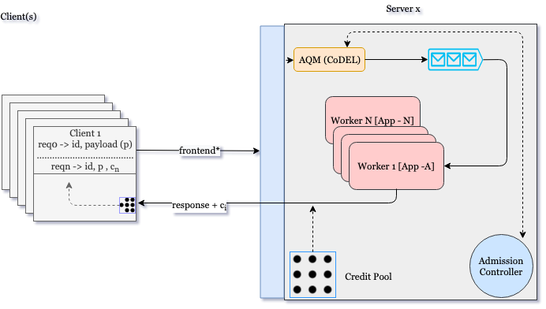

# khudib

A re-implementation of breakwater (https://github.com/shenango/caladan/tree/main/breakwater) in rust for use with RPC-based systems. Breakwater is a server overload control system for microsecond Remote Procedure Calls(RPCs). We introduce sidecars to mediate, monitor and report on client-server invocations on short/long RPCs for microservice distributed systems.

# Design
The system has the following components:

## Client Application
The client app makes requests using credits assigned by the server. The initial request is normal but with specific load - such as in the number of requests to be processed.
The next requests shall include varied credits (A typical implementation on a single client requires multiple client processes and request identification all unique)

## Client Sidecar

## Server Sidecar

## Server Application
The server app has the following components:
### Queue Management Controller 
### Queues
### Admission Controller
### Workers
In rust, these are the threads activated as per the queues.
### Credit Pool
This uses a number of algorithms defined in the paper.
